# MovieRentalStore
The REST API which based on SpringBoot, Java, Lombok, Hibernate, JUnit and SQL database.

## Table of contents
* [General Information](##General Information)
* [Screenshots](##Screenshots)
* [External Api](##External Api)
* [Technologies](##Technologies)
* [Setup](##Setup)

## General Information
The Movie Rental Store is simple api where there is a possibility to borrow copy of the movie. There are to type of media: DVD or Blu-Ray. This Api has the capabilities to:
Movies:
* get all movies
* get the movie by id
* get movies by a title fragment, director fragment, description fragment, type or year
* create new movie
* update the movie
Copies:
* get all copies
* get the copy by id
* get copies which is available, DVD, Blu-Ray or combinations of this
* create new copy
* update the copy
* delete the copy
Borrows:
* get all borrows
* get the borrow by id
* get borrows by the movie or the customer
* create new borrow
* change the return date of the borrow
* finalised the borrow
Customers:
* get all customers
* get the customer by id
* create new customer
* update the customer
* delete the customer
Archive Data:
* get all realised borrows
* get all deleted copies
* get all deleted customers
* get finished borrows by movie
* get finished borrows by customer

## Screenshots

### Movie Endpoints:

    * Get all movies (http method GET)
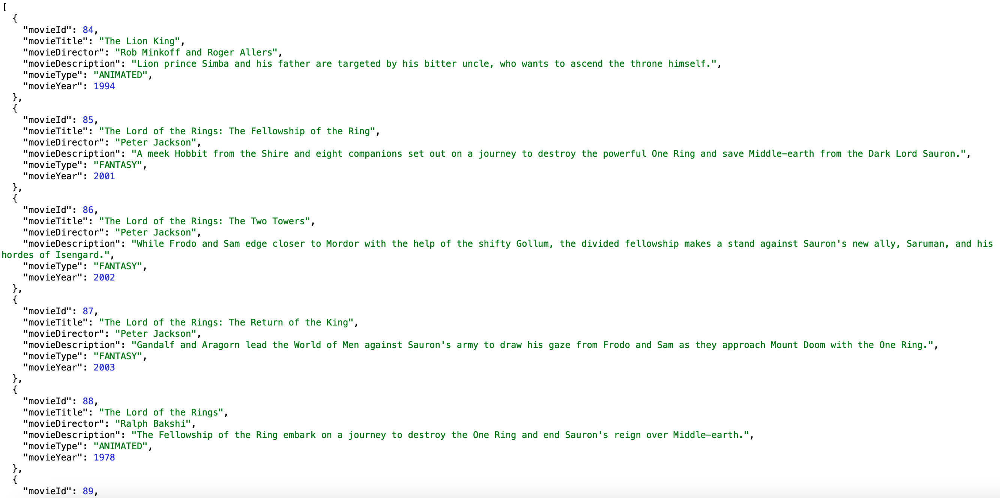

    * Get movie by id (http method GET)
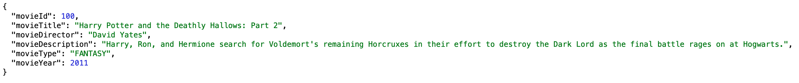

    * Get movies by title fragment (http method GET)
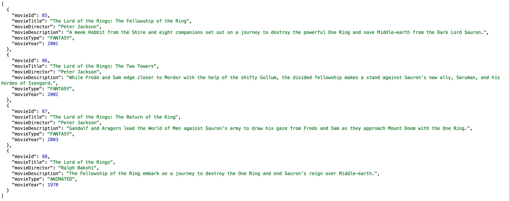

    * Get movies by director fragment (http method GET)
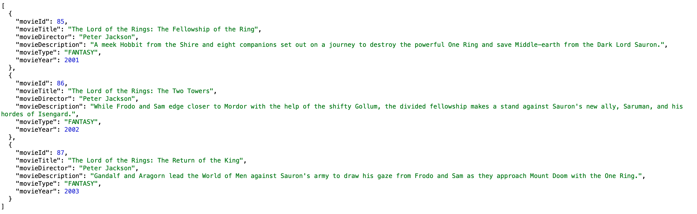   

    * Get movies by description fragment (http method GET)
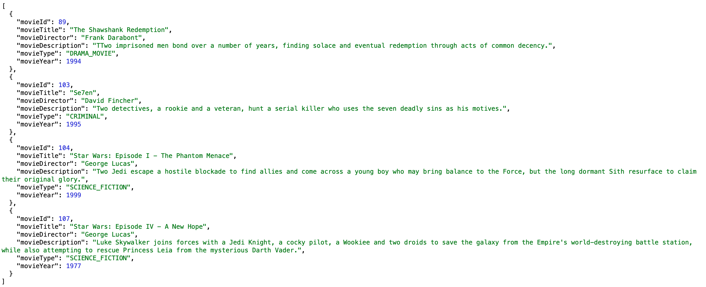   

    * Get movies by type of movie (http method GET)
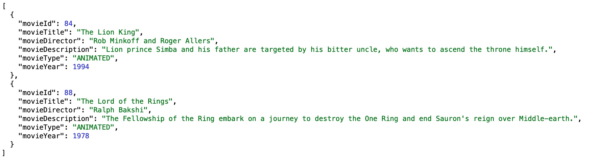   

    * Get movies by year production (http method GET)
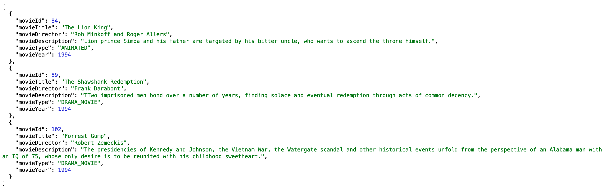  

    * Create movie (http method POST)
    * Update movie (http method PUT)

### Copy endpoints:

    * Get all copies (http method GET)
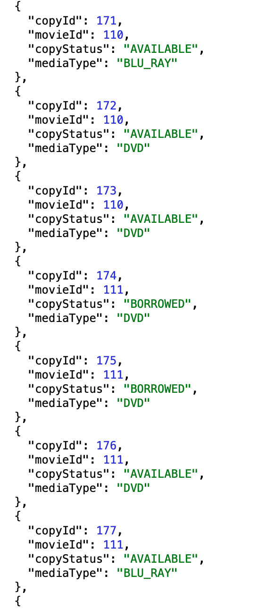

    * Get copies for movie (http method GET)
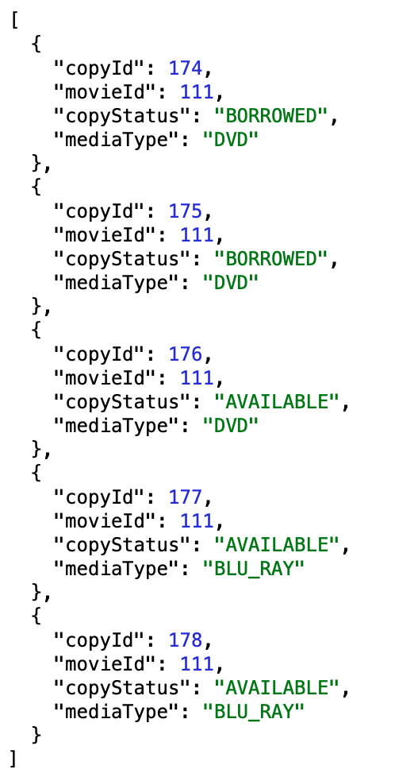

    * Get available copies (http method GET)
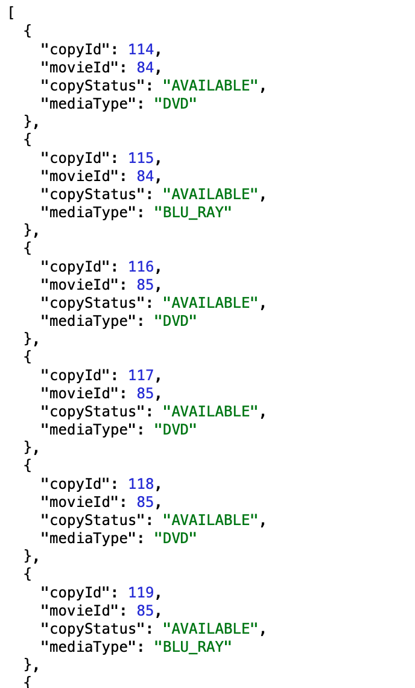

    * Get available copies for movie (http method GET)
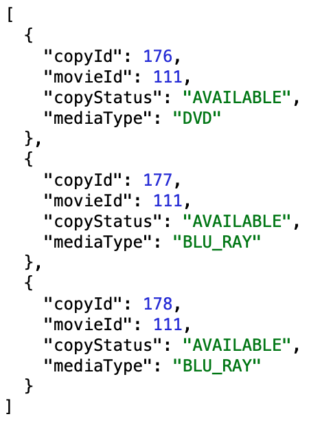   

    * Get DVD copies for movie (http method GET)
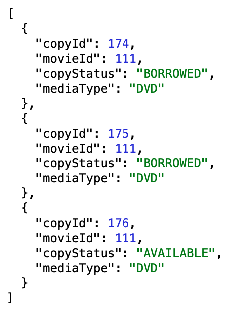   

    * Get available DVD copies for movie (http method GET)
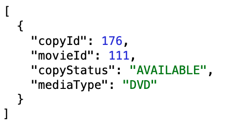   

    * Get Blu-Ray copies for movie (http method GET)
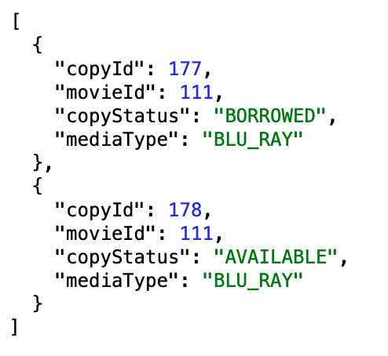  

    * Get available Blu-Ray copies for movie (http method GET)
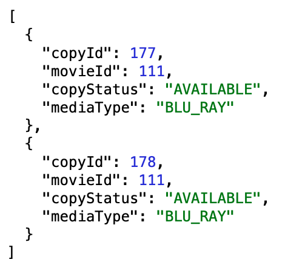  

    * Get copy by id (http method GET)
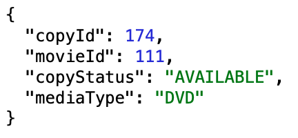  

    * Create copy (http method POST)
    * Update copy (http method PUT)
    * Delete copy (http method DELETE)
    
### Borrow endpoints:

    * Get all borrows (http method GET)
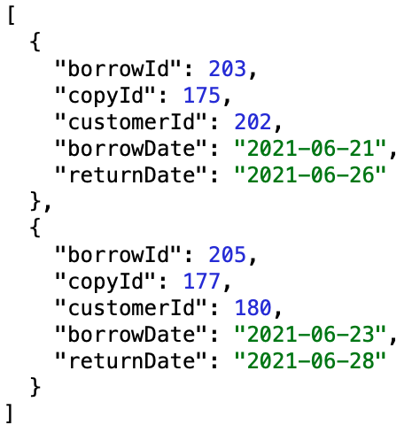
    
    * Get borrow by id (http method GET)
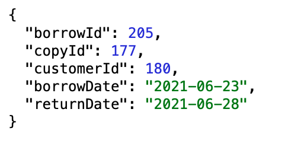  

    * Get borrows for movie (http method GET)
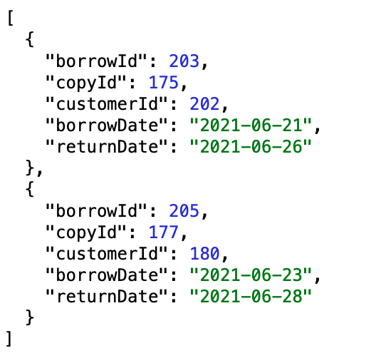

    * Get borrows for customer (http method GET)
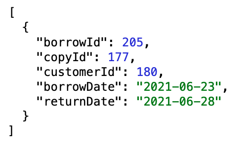  

    * Create borrow (http method POST)
    * Change borrow return date (http method PUT)
    * Borrow is finish (http method DELETE)
    
### Customer endpoints:

    * Get all customers (http method GET)
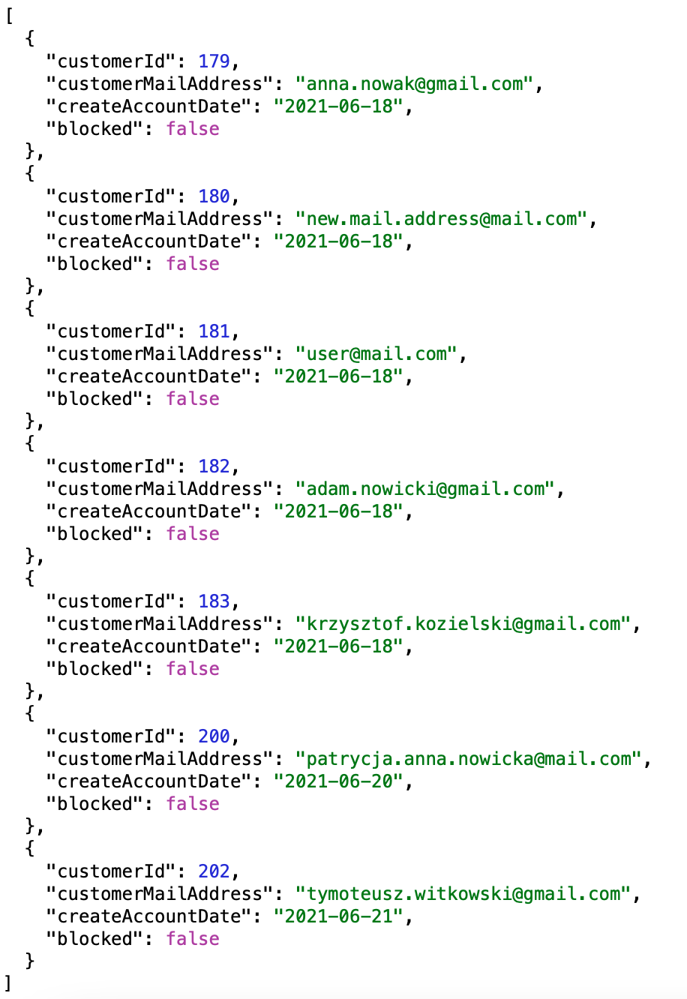

    * Get customer by id (http method GET)
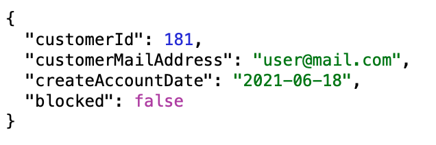

    * Create customer (http method POST)
    * Update customer (http method PUT)
    * Delete customer (http method DELETE)
    
### Archive endpoints:

    * Get all realised borrows (borrows from archive, http method GET)
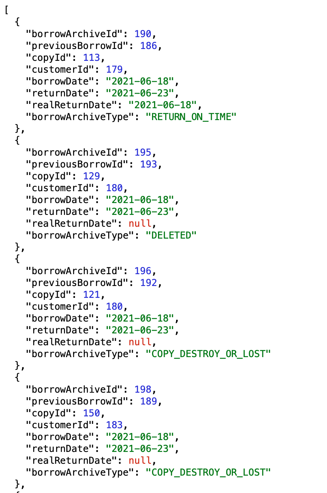

    * Get all copies which were deleted (deleted copies, http method GET)
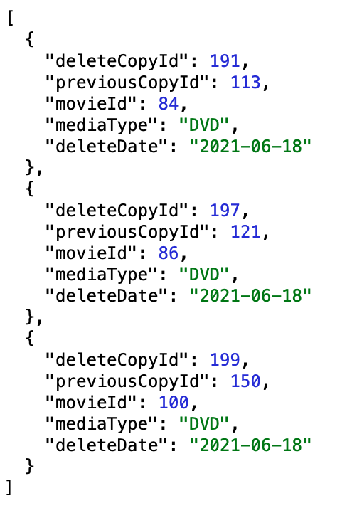

    * Get all customers which were deleted (deleted customers, http method GET)
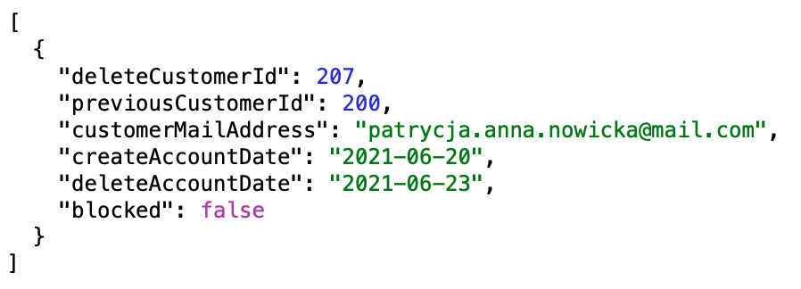

    * Get realised borrows for movie (http method GET)
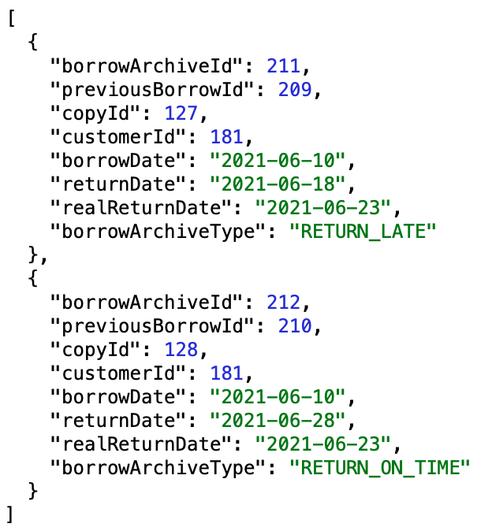   

    * Get realised borrows for customer (http method GET)
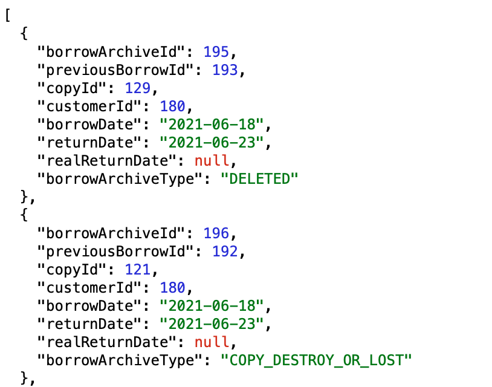   

### Endpoints from external api:

    * Get more details for movie (http method GET)
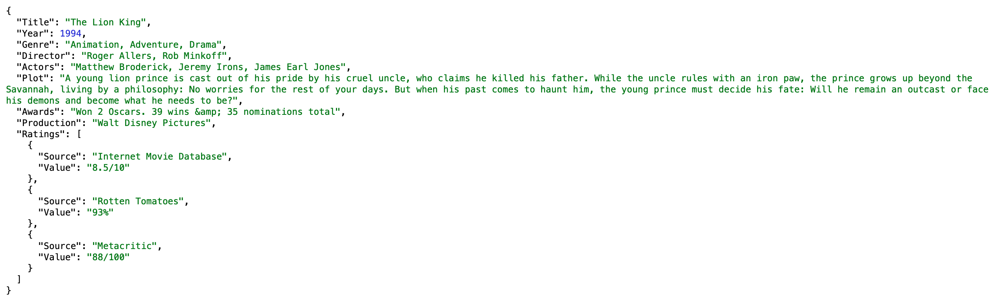

    * Get review from movie (http method GET)
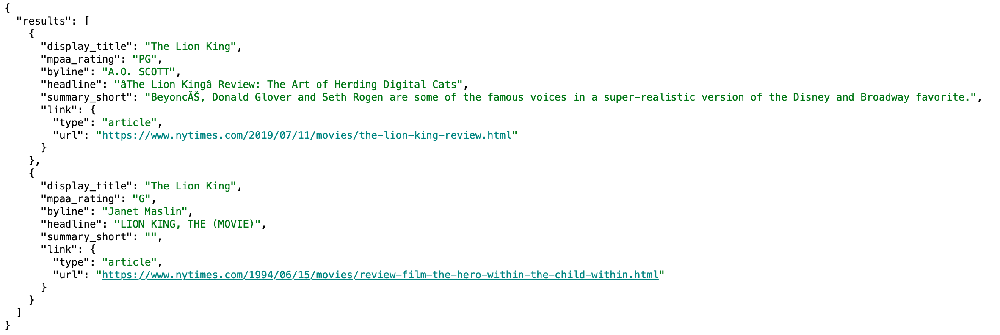

## External Api
* Open Movie Database (OMDb) Api https://www.omdbapi.com
* Movie Review Api https://developer.nytimes.com/docs/movie-reviews-api/1/overview

## Technologies
* JAVA 11
* Spring
* SpringBoot
* JUnit
* MySQL Database
* H2 Database
* Gradle

## Setup
1. Download code from: https://github.com/nataliaSzczecinska/MovieRentalStore

2. Run a backend application in IntelliJ IDEA or Eclipse
 
## Licence
Freeware
